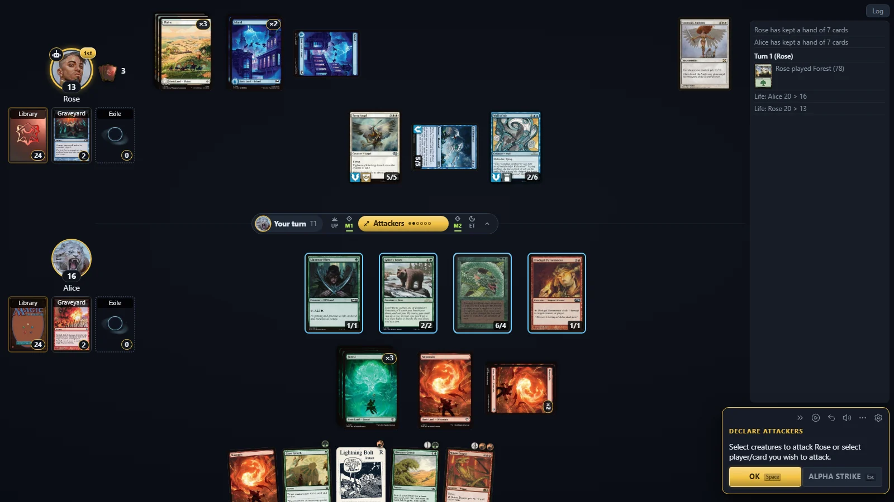
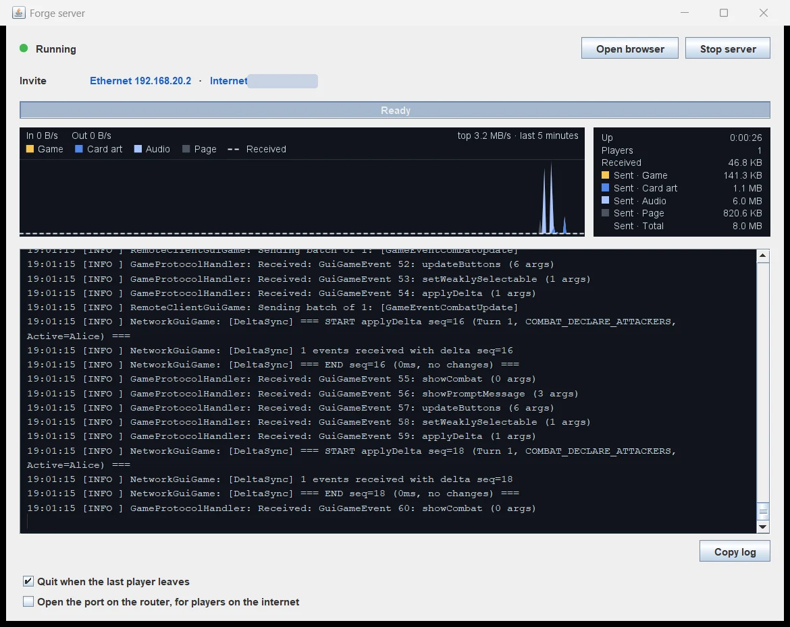
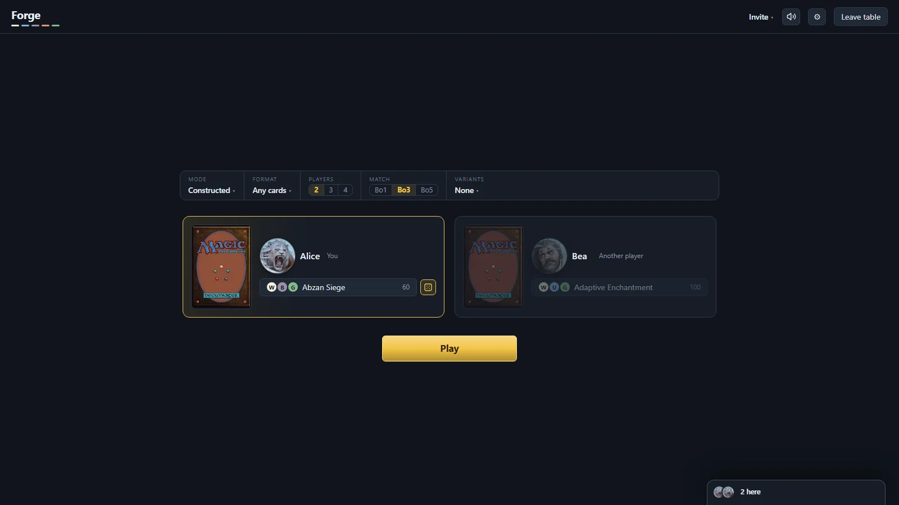

# Forge Web GUI

Plays Forge in a web browser. One computer runs Forge as a small server, and everyone, the person running it
included, plays in a browser. Other players need only a browser and a link; they install nothing.

The person running the server is the **host**. Everyone who joins by link is a **guest**.

## Build and start

You need Java 17 or later and Maven. From the repository root:

    mvn -Pweb -pl forge-gui-web -am install -DskipTests
    java -jar forge-gui-web/target/forge-gui-web.jar

`-Pweb` is needed because the web module is left out of Forge's normal build. Maven fetches its own Node for the
browser code. Start from the repository root or a Forge install, so Forge finds its `res` folder, or pass
`-Dforge.assets.dir=<folder holding res>`.

Two windows open: the game, in a browser window, and the **server window**.

The server window starts and stops the server and shows the links to join. It graphs the last five minutes of
traffic, split into game, card art, audio and page, with totals and uptime beside it. Its log can be copied with
**Copy log**. Closing it quits Forge, and so does closing the last browser, after 15 seconds, unless **Quit when
the last player leaves** is unticked.

| Option (before `-jar`) | Effect |
|---|---|
| `-Dforge.web.port=<n>` | Another port. The default, 36743, is desktop Forge's network port; change it to host from both at once. |
| `-Dforge.web.noBrowser=true` | Do not open the game window. |
| `-Dforge.web.noConsole=true` | No server window. The link is printed instead. |

## Playing

The start page offers **Play the computer**, **Play with friends** and **Decks**. Either way of playing leads to
Constructed, Draft or Sealed.

At a table, the match bar sets the **Mode** (Constructed, Commander and the other game types), the **Format** that
limits the cards, the number of **Players**, the **Match** length (best of one, three or five) and any
**Variants**. Only the host changes them.

To invite someone, send them a link from **Invite** at the top of the table, or click an address in the server
window's Invite row to copy it.

- A home-network address (`192.168.…`) works for people on the same network.
- The internet address works once the router forwards the port to this computer. Tick **Open the port on the
  router** in the server window and Forge asks the router by UPnP each time the server starts. The window says
  whether it agreed; if not, turn on UPnP in the router or forward the port by hand.

Links are made afresh each time Forge starts. A player who reloads or loses the connection returns to their seat,
and a match carries on where it was.

## Decks and settings

**Decks** builds, edits and imports decks. Import takes a pasted list, a deck file, or a link from Moxfield,
Archidekt, TappedOut or MTGGoldfish, and marks any line it could not read.

The host's decks and settings are desktop Forge's own, so a change in one shows in the other. A guest's decks are
kept in the guest's browser, and its settings start from Forge's defaults. **Copy as text** in the deck editor
keeps a copy anywhere.

The cog opens **Options**: gameplay, display, keys, dev mode and custom CSS. Auto-pass stops, auto-yields and
conceding are in the ⋯ menu beside it. Custom CSS applies as you type, and can be exported and imported to share a
theme.

---

## For developers

The Java side (`src/main/java`) runs the engine and serves the page. The browser side (`src/main/ts`) is TypeScript
and Preact, bundled into `src/main/resources/web/js/` (a build output, not committed). Rarely used code, such as
three.js for a player's portrait breaking, is split into `js/chunks/` and loaded on first use.

**Running from IntelliJ.** The **Forge Web** run configuration builds the bundle and starts `forge.web.WebMain` with
`-Dforge.web.pageDir=forge-gui-web/src/main/resources/web`, so the page is read from disk and a change needs only a
reload. CSS and `index.html` are served as they are; for TypeScript, run `npm run watch` in this folder, or
`npm run build` to type-check and build once. Use the Node Maven installed (`node/`) or any Node 22.

**The protocol.** Every message is a Java record in `ToBrowser` or `FromBrowser`. `src/main/ts/protocol.gen.ts` is
generated from them and from Forge's `TrackableProperty`, so each field is named in one place. After changing a
record, regenerate it, and the compiler shows what the client must change:

    mvn -Pweb -pl forge-gui-web -am test -Dtest=ProtocolTypesTest -Dsurefire.failIfNoSpecifiedTests=false -Dforge.web.writeProtocol=true

`ProtocolTypesTest` fails whenever the committed file is out of date. A field may be null only when marked
`@Nullable`; it is then left out of the JSON and optional in TypeScript.

**Tests.** `mvn -Pweb -pl forge-gui-web -am test` runs the Java tests and the Vitest tests in `src/test/ts`
(`npm test` runs only the latter). Whole-game tests need `-Drun.stress.tests=true`. `SharedTraceTest` and
`model.test.ts` replay one recorded game (`src/test/resources/traces/whole-game.json`) through the Java and
TypeScript models, so they cannot drift apart. After the model or the messages change, record a new one:

    mvn -Pweb -pl forge-gui-web -am test -Dtest=TraceRecordingTest -Dsurefire.failIfNoSpecifiedTests=false -Dforge.web.writeTraces=true

`e2e/` drives the page in a real browser against a real server, each test on its own port with a throwaway home
folder. Build the jar first, then:

    cd forge-gui-web/e2e
    npm ci
    npx playwright install chromium   # once
    npx playwright test

**Where things are.**

- `ToBrowser`, `FromBrowser` and `Wire` define and write the protocol; `protocol.ts` adds the views the client reads
  game objects through.
- `model.ts` is the browser's copy of the game's object table. `BrowserModel` is the server's copy, sent in full to
  a browser that connects or reloads.
- `app.ts` receives every message, is the only place that sends one, and draws at most once per frame. Everything
  else acts through `actions.ts`.
- `WebSession` is one browser, and where it is (start page, table, match) is one `Stage`, changed only through
  `move`. `WebSessions` holds them all, and `Lobby` is one browser's view of match setup.
- `PlayerSettings` is one player's settings: Forge's preferences for the host, the session's own for a guest.
- `DeckSession`, `DeckEditor`, `DeckImport` and `Legality` are the deck editor, the importer and the format checks.
- `WebServer` serves the page, card images (`CardThumbnails` shrinks them for the board) and the socket, and
  `ServerTraffic` counts its bytes for the server window, `ServerConsole`.
- The board (`board.ts` and what it calls) is drawn by hand, as it is placed by measuring and animated card by card.
  Everything around it is Preact components in the `.tsx` files, drawn by `screens.tsx` every frame.
