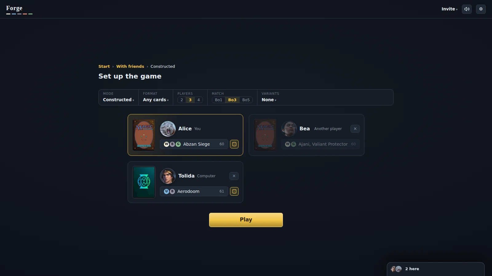
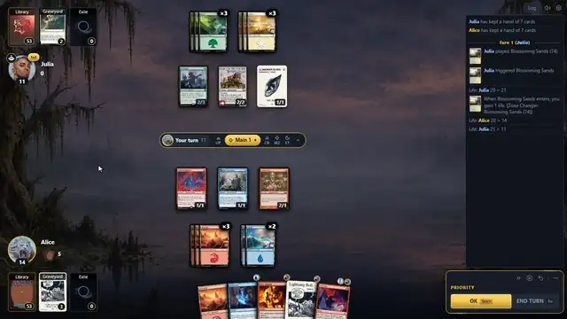
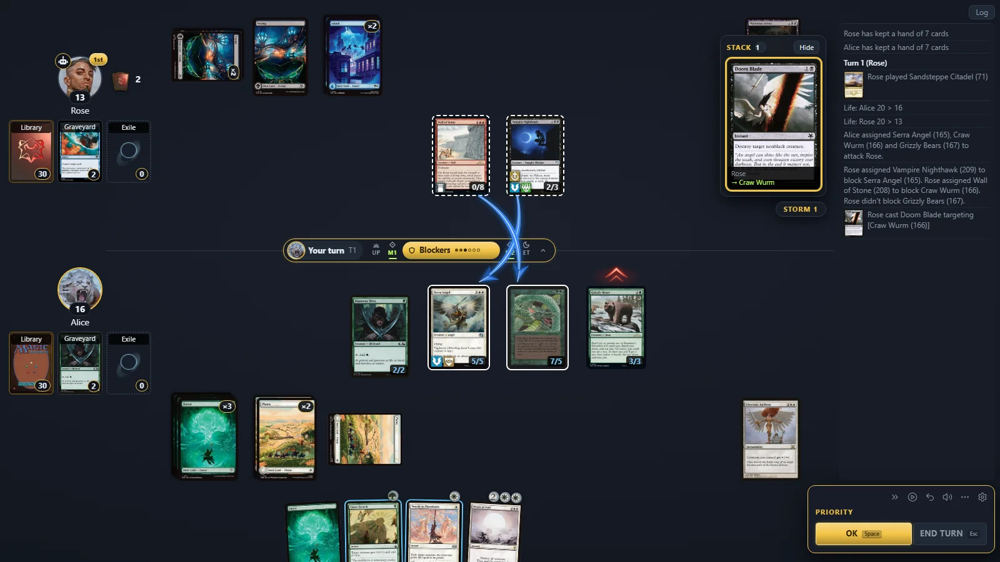
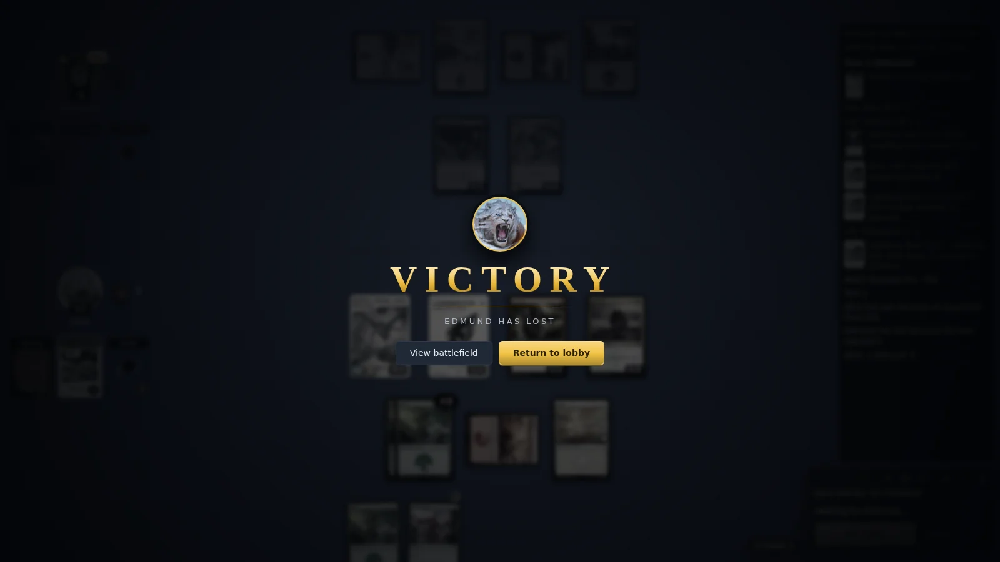
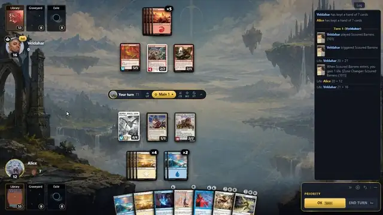
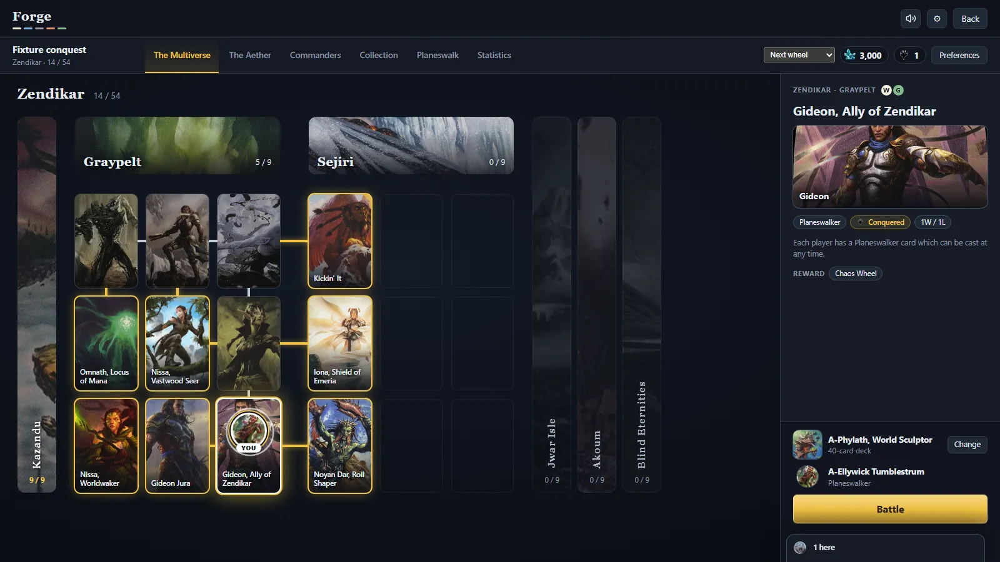
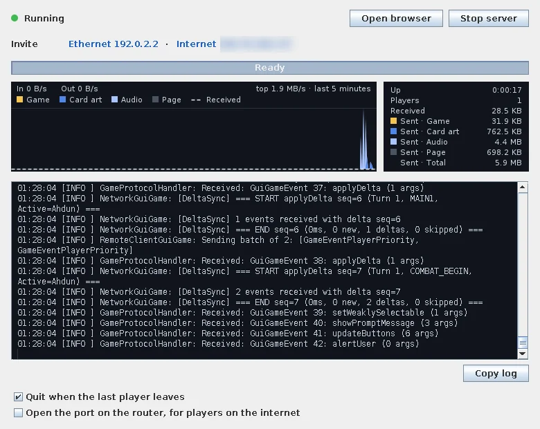

# Forge Web GUI

Forge in a web browser with a modern interface. The host runs a small server on their computer. Players join by
web link with no further install required. You can also play alone against the computer.

It has fewer options than desktop Forge and is meant to be quick to learn. It is made for a mouse and keyboard
first. Phones are only partly supported. You can set up and play a match on a phone, but the deck editor, Draft,
Sealed, Planar Conquest and Quest are laid out for a computer screen.

<p>
  
  
</p>
<p>
  
  
</p>
<p>
  
  
</p>

## For players

### What you can play

- Constructed, Commander, Brawl, Oathbreaker, Tiny Leaders, Momir Basic and MoJhoSto, for up to four players.
- Vanguard, Planechase, Archenemy and Archenemy Rumble.
- Draft and Sealed for up to eight. The computer fills any empty seats.
- Planar Conquest.
- Quest, which is still being built.

Not yet: Adventure, puzzles, constructed gauntlets and Winston draft.

### Starting it

1. Install Java 17 or newer.
2. Download `forge-web.zip` from the [pre-release](https://github.com/MostCromulent/forge/releases/tag/web-snapshot)
   and unzip it anywhere.
3. Open `forge-gui-web.jar`. If nothing happens, run `java -jar forge-gui-web.jar` in that folder.

The game opens in your browser and a server window opens beside it. Closing that window quits Forge. Forge also
quits when the last browser leaves, unless you untick **Close Forge when everyone has left, including you**. To
update, replace the folder with the new zip.



### Playing with friends

Click **Invite** at the top of the table, or **Copy link** in the server window. There are two links. One is for
people on your home network. The other is for people on the internet, and works only once your router forwards
Forge's port to your computer. **Forward the port automatically (UPnP)** asks the router to do that. If your
router won't, the [network setup guide](https://github.com/Card-Forge/forge/wiki/Network-Play#network-configuration)
explains how to do it by hand.

Anyone with a link can join and the connection isn't encrypted, so only send links to the people you're playing
with. Don't share the host's own link. It controls the table and the server. The links change each time Forge
starts. A player who reloads the page or loses their connection gets their seat back.

### Decks, saves and settings

Build decks in the deck editor or import them from a pasted list, a deck file, or a Moxfield, Archidekt,
TappedOut or MTGGoldfish link.

The host's decks, settings and Conquest and Quest saves are kept in the Forge user folder. Desktop Forge uses
the same folder, so a change in one shows in the other. If you already play desktop Forge, back that folder up
first. It is `%APPDATA%\Forge` on Windows, `~/Library/Application Support/Forge` on macOS and `~/.forge` on Linux.

A guest's decks are kept in their own browser, for the link they joined with. A private window keeps none.
Display settings, keyboard shortcuts and custom CSS are kept in each browser, including the host's.

---

## For developers

The Java side (`src/main/java`) runs the engine and serves the page. The browser side (`src/main/ts`) is
TypeScript and Preact, bundled by the build into `src/main/resources/web/js/`, which git ignores.

### Building

    mvn -Pweb -pl forge-gui-web -am install -DskipTests
    java -jar forge-gui-web/target/forge-gui-web.jar

Forge's default build leaves this module out, so `-Pweb` is needed. Maven downloads its own copy of Node. The jar
needs `target/lib/` beside it. It looks for Forge's `res` folder in the folders above where it runs. If it can't
find it, pass `-Dforge.assets.dir=<folder containing res>`.

| Option | Effect |
|---|---|
| `-Dforge.web.port=<n>` | Port to serve on. The default, 36743, is desktop Forge's network port too. |
| `-Dforge.web.noBrowser=true` | Don't open the game in a browser. |
| `-Dforge.web.noConsole=true` | Don't open the server window. The host's link is printed instead. |
| `-Dforge.web.pageDir=forge-gui-web/src/main/resources/web` | Serve the page from source, so a change needs only a reload. |

With `pageDir` set, `npm run watch` in this folder rebuilds the TypeScript on save.

### How it fits together

One Java process runs Forge and serves the page on a single port. Each browser is one player, connected over a
WebSocket.

```
browser (src/main/ts)                server (src/main/java/forge/web)              Forge
─────────────────────                ────────────────────────────────              ─────
main.ts ◀── WebSocket /ws ──▶ WebServer ─▶ WebSessions ─▶ WebSession   (one per browser)
  │                                                           │
  ├─ model.ts   ◀─ state, prompt,  ── WebGuiGame (IGuiGame) ◀─┤─ LocalGame: a netplay client ◀─┐
  ├─ board.ts      questions                                  │                                 │ loopback
  ├─ screens.tsx                                              ├─ Lobby  (ServerGameLobby)       │ netplay
  └─ actions.ts ── what the player did ──────────────────────▶└─ DeckSession, OnlineDraft …     │
                                                                  FServerManager ◀── the game ──┘
```

Every seat is a netplay client, including the host's. The host's `LocalGame` starts Forge's netplay server
(`FServerManager`) on loopback and joins it. Each guest's session joins the same server. The lobby, drafts, delta
packets and `IGuiGame` calls are the same ones desktop netplay uses. Only the web port is reachable from outside.

`WebServer` (Netty) serves the page, card images, sounds and the socket. It refuses any request without one of
the two link tokens. Only the host's token can take the host's seat. There is one `WebSession` per browser. It
knows which screen the browser is on and passes its messages to `Lobby`, `DeckSession`, the draft classes,
`ConquestGame` and `QuestGame`, or `WebGuiGame` during a match.

`WebGuiGame` is the web's `IGuiGame`. It sends the browser what changed as JSON. When the game needs an answer,
the call becomes a request and `PendingRequests` holds the game's thread until the reply comes. A browser that
reloads is sent the whole table again and every question that is still open.

In the page, `main.ts` is the only module that talks to the server. Incoming messages update `model.ts` and the
page is redrawn from the model once a frame. The board is drawn by hand in `board.ts`. The rest uses Preact.
Components never send messages themselves. They call `actions.ts`.

### The protocol

Messages are Java records in `ToBrowser` and `FromBrowser`. Each build generates `src/main/ts/protocol.gen.ts`
from them and type-checks the TypeScript against it. Changing a record breaks the build wherever the browser
uses it. A field may be null only if it is marked `@Nullable`.

- To add a question the game asks, implement the `IGuiGame` method in `WebGuiGame` with `ask(request, check)`,
  add a `@Request` record to `ToBrowser` and draw it in `dialogs.tsx`. `WebGuiGameTest` fails while any such
  method is still left to Forge's default.
- To add a message, write a `@Message` record in `ToBrowser` and handle it in `main.ts`, or a `@Command` record
  in `FromBrowser` and handle it where `WebSession` routes it.
- A new game property needs no work. It travels with the rest of `TrackableProperty`.

### Text and languages

All the text a player sees comes from Forge's language files (`forge-gui/res/languages`). The page's own keys
are grouped at the end of `en-US.properties` under `#forge-gui-web`. In TypeScript, `t('lblWebSomething', arg…)`
returns the text. `tNodes` does the same when a sentence has elements inside it. The build fails if
`en-US.properties` lacks a `lblWeb…` key the page uses. On the Java side, text sent for display goes through
`Localizer`.

The texts follow `java.text.MessageFormat`. `{0}` is an argument and an apostrophe is written twice (`can''t`).
Write whole sentences with arguments in them rather than joining pieces together.

### Tests

The tests catch changes elsewhere in Forge that would break this module without anyone noticing. They cover the
wire format, `IGuiGame` calls left unanswered, a web seat answering the engine's prompts, netplay between host
and guest, and the server's tokens and paths.

`mvn -Pweb -pl forge-gui-web -am test` runs the Java tests and Vitest. `npm test` runs Vitest alone. Adding
`-Drun.stress.tests=true` also plays whole games and events over netplay, as the snapshot build does. The tests in
`e2e/` drive the page in a real browser against a built jar. They only run locally:

    cd forge-gui-web/e2e
    npm ci
    npx playwright install chromium   # first time only
    npx playwright test
