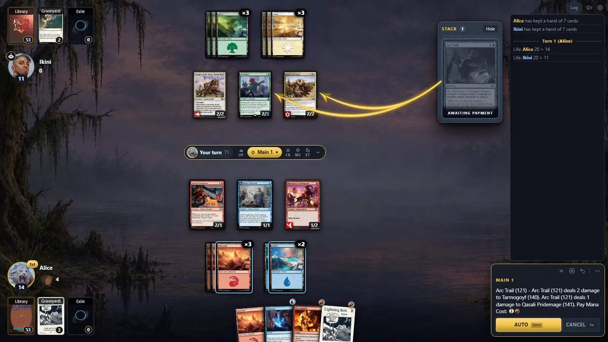
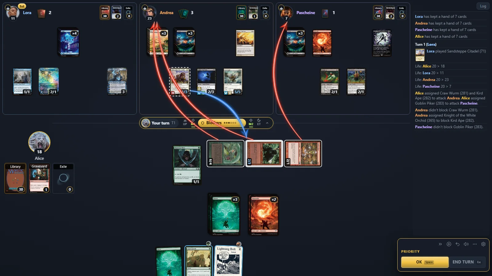

# Forge Web GUI

Play Forge in a web browser. One computer runs Forge as a small server; everyone, including the host, plays in a
browser. Friends install nothing: you send them a link.

The interface aims to be modern and easy to pick up, and leaves out much of desktop Forge's detailed customisation.
It is built for a computer with a mouse and keyboard; phones and tablets aren't supported yet.

  
  

  
  

## For players

The person running the server is the **host**; anyone who joins by link is a **guest**.

### What you can play

- **Constructed**, Commander, Brawl, Oathbreaker, Tiny Leaders, Momir Basic and MoJhoSto, for up to four players.
- The variants **Vanguard**, **Planechase**, **Archenemy** and **Archenemy Rumble**.
- **Draft** and **Sealed**, for up to eight, against the computer or with friends. The computer fills empty seats.

Not yet: Quest, Adventure, Planar Conquest, puzzles, constructed gauntlets and Winston draft.

### Starting it

You need Java 17 or newer and Maven. From the top folder of the Forge repository:

    mvn -Pweb -pl forge-gui-web -am install -DskipTests
    java -jar forge-gui-web/target/forge-gui-web.jar

This opens the game in your browser, and the **server window**, which starts and stops the server and shows the
links people join by. Closing it quits Forge, as does the last browser closing, unless you untick **Quit when the
last player leaves**.

### Playing with friends

Click **Invite** at the top of the table, or an address in the server window, to copy a link.

- A local address (often `192.168.…`) works on your home network.
- The internet address works for everyone else if your router lets them in. Tick **Open the port on the router**
  in the server window; if that fails, turn on UPnP on your router or forward the port by hand.

Anyone with a guest link can join, and the links aren't encrypted, so only send them to people you're playing with.
Never share the host's own link: it controls the table and the server. Links change each time Forge starts.

Only the host sets up the match, in the bar along the top of the table. A player who reloads or drops out goes
straight back to their seat.

### Decks and settings

**Decks** builds, edits and imports decks: a pasted list, a deck file, or a Moxfield, Archidekt, TappedOut or
MTGGoldfish link.

- The host's decks and game settings are desktop Forge's own, so a change in one shows in the other.
- A guest's decks are kept in their browser, for the exact link they joined by, and a private window keeps
  nothing. **Copy as text** in the deck editor keeps a copy elsewhere.
- Display settings, keys and custom CSS are kept in each browser, the host's too.

The cog opens **Options**, and the **⋯** button in a game offers a draw, auto-pass stops and conceding.

---

## For developers

The Java side (`src/main/java`) runs the engine and serves the page. The browser side (`src/main/ts`) is TypeScript
and Preact. The build bundles it into `src/main/resources/web/js/`, which git ignores, so a fresh checkout has no
page to serve until it is built.

### Building

`-Pweb` is needed because Forge's default build leaves this module out. Maven fetches its own Node for the browser
build. The jar finds Forge's `res` folder by searching up from where it runs; if it can't, pass
`-Dforge.assets.dir=<folder containing res>`. It needs `target/lib/` beside it.

| Option | Effect |
|---|---|
| `-Dforge.web.port=<n>` | Port to serve on. The default, 36743, is desktop Forge's network port too. |
| `-Dforge.web.noBrowser=true` | Don't open the game in a browser. |
| `-Dforge.web.noConsole=true` | Don't open the server window; the host's link is printed instead. |
| `-Dforge.web.pageDir=forge-gui-web/src/main/resources/web` | Serve the page from source, so a change needs only a reload. |

With `pageDir` set, run `npm run watch` in this folder to rebuild the TypeScript on save. Use the Node Maven
installed (`node/`) or any Node 22.

### The protocol

Messages are Java records in `ToBrowser` and `FromBrowser`. `src/main/ts/protocol.gen.ts` is generated from them
and from Forge's `TrackableProperty`; after changing a record, regenerate it and let the compiler show what to fix:

    mvn -Pweb -pl forge-gui-web -am test -Dtest=ProtocolTypesTest -Dsurefire.failIfNoSpecifiedTests=false -Dforge.web.writeProtocol=true

`ProtocolTypesTest` fails when the file is out of date. A field may be null only if marked `@Nullable`.

### Tests

- `mvn -Pweb -pl forge-gui-web -am test` runs the Java tests and the Vitest tests; `npm test` runs only Vitest.
  Whole-game tests need `-Drun.stress.tests=true`.
- `SharedTraceTest` and `model.test.ts` replay one recorded game through the Java and TypeScript models to keep them
  in step. After changing the model or messages, record it again:

      mvn -Pweb -pl forge-gui-web -am test -Dtest=TraceRecordingTest -Dsurefire.failIfNoSpecifiedTests=false -Dforge.web.writeTraces=true

- `e2e/` drives the page in a real browser against a real server. Build the jar, then:

      cd forge-gui-web/e2e
      npm ci
      npx playwright install chromium   # first time only
      npx playwright test

---

🤖 Generated with [Claude Code](https://claude.com/claude-code)
