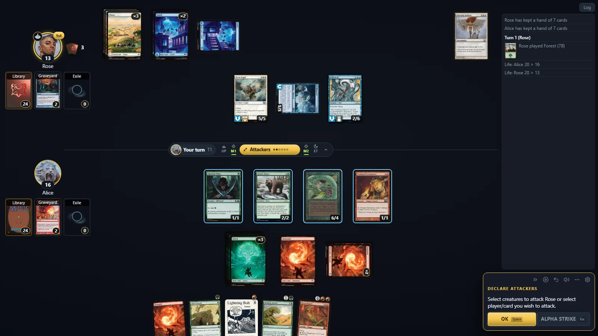

# Forge Web GUI

This lets you play Forge in a web browser. One computer runs Forge as a small server, and everyone plays in a
browser, including the person running it. Friends don't need to install anything. You send them a link and they
open it.

The first half of this page is for players. The second half is for developers.

## For players

The person running the server is the **host**. Anyone who joins with a link is a **guest**.

### What you can play

- **Constructed**, plus Commander, Brawl, Oathbreaker, Tiny Leaders, Momir Basic and MoJhoSto.
- The casual variants **Vanguard**, **Planechase**, **Archenemy** and **Archenemy Rumble**, on top of those.
  Vanguard doesn't go with Momir Basic or MoJhoSto.
- **Draft** and **Sealed**, against the computer or with friends. Against the computer, you can play your deck
  against one opponent, or all of them one after another. After a draft you can also play up to three at once.

A match seats up to four players. A draft seats up to eight, and the computer fills any empty seats. At a table
against the computer, the host can hand their own seat to the computer and watch.

Not available yet: **Quest**, **Adventure**, **Planar Conquest**, **puzzles**, desktop's constructed
**gauntlets** and **Winston** draft. Use desktop or mobile Forge for those.

### Starting it

You need Java 17 or newer, and Maven. From the top folder of the Forge repository, run:

    mvn -Pweb -pl forge-gui-web -am install -DskipTests
    java -jar forge-gui-web/target/forge-gui-web.jar

Two windows open: the game, in your browser, and the **server window**.

The server window starts and stops the server, and shows the links people can use to join. It also shows a graph
of network traffic, and a log you can copy with **Copy log**.

Closing the server window quits Forge. Forge also quits 15 seconds after the last browser closes, unless you
untick **Quit when the last player leaves**.

### Playing

The host's start page has three choices: **Play the computer**, **Play with friends** and **Decks**. Both ways of
playing let you choose Constructed, Draft or Sealed.

A guest joins the host's table and plays there. A guest can't play the computer on their own, change how the table
is set up, or use dev mode.

At the table, the bar along the top sets up the match:

- **Mode**: Constructed, Commander or another game type.
- **Format**: which cards are allowed.
- **Players**: how many seats there are.
- **Match**: one game, or best of three or five.
- **Variants**: Planechase, Archenemy and so on.

Only the host can change these.

To invite a friend, click **Invite** at the top of the table and send them the link. You can also click an address
in the server window to copy its link.

- A local address (often starting with `192.168.`) works for people on your home network.
- The internet address works for everyone else, but only if your router lets them through. Tick **Open the port on
  the router** in the server window and Forge will ask your router to allow it. The window tells you whether that
  worked. If it didn't, turn on UPnP in your router's settings, or set up port forwarding by hand.

Anyone with a guest link can join, so only send it to people you're playing with. The links aren't encrypted. Never
share the host's own link, the one Forge opens for you: it can change the table and stop the server. The links
change every time Forge starts.

If someone reloads the page or loses their connection, they go straight back to their seat and the game carries
on.

### Decks and settings

**Decks** lets you build, edit and import decks. You can import a pasted list, a deck file, or a link from
Moxfield, Archidekt, TappedOut or MTGGoldfish. Any line Forge can't read is marked so you can fix it.

The host shares decks and game settings with desktop Forge, so changes in one show up in the other. Display
settings, keys and custom CSS are kept in the browser, for the host too.

A guest's decks are saved in their own browser, for the exact link they used. If a guest joins by the home-network
address one day and the internet address the next, they won't see the decks they saved before, and a private window
keeps nothing. To keep a copy somewhere else, use **Copy as text** in the deck editor.

The cog button opens **Options**: gameplay, display, keys, custom CSS, and dev mode for the host. Custom CSS changes
the look as you type, and you can export it to share with others. The speaker button sets sound and music volume.

During a game, the **⋯** button next to the cog lets you offer a draw, set auto-pass stops and auto-yields, and
concede. With dev mode on, it also has the host's dev cheats.

---

## For developers

The Java code (`src/main/java`) runs the game engine and serves the page. The browser code (`src/main/ts`) is
TypeScript and Preact. It's bundled into `src/main/resources/web/js/`, which is build output and isn't committed.
Code that's rarely needed, such as three.js for the shattering portrait effect, goes in `js/chunks/` and only loads
when it's used.

### Building

The build command needs `-Pweb` because Forge's normal build leaves the web module out. Maven downloads its own copy
of Node to build the browser code.

The jar finds Forge's `res` folder by looking up from where it's started and from where the jar itself is, so it
works from anywhere in the repository. If it can't find it, add `-Dforge.assets.dir=<folder that contains res>`.
The jar needs the `target/lib/` folder beside it, and no Forge installer includes the web module yet.

You can add these options before `-jar`:

| Option | What it does |
|---|---|
| `-Dforge.web.port=<n>` | Uses a different port. The default, 36743, is the same as desktop Forge's network port, so change it if you want to host from both at once. |
| `-Dforge.web.noBrowser=true` | Doesn't open the game window. |
| `-Dforge.web.noConsole=true` | Doesn't open the server window. The host's link is printed instead; guest links then come from **Invite** in the page. |

### Changing the browser code

Start the server with `-Dforge.web.pageDir=forge-gui-web/src/main/resources/web` and it reads the page straight
from the source folder, so after a change you only need to reload the browser.

CSS and `index.html` changes show up on reload. For TypeScript, run `npm run watch` in this folder to rebuild as you
save, or `npm run build` to check types and build once. Use the Node that Maven installed (`node/`) or any Node 22.

### The protocol

Every message between the server and the browser is a Java record in `ToBrowser` or `FromBrowser`. The TypeScript
types in `src/main/ts/protocol.gen.ts` are generated from those records and from Forge's `TrackableProperty`, so
each field is only defined in one place. After you change a record, regenerate the file, and the TypeScript
compiler will show you what needs updating in the browser code:

    mvn -Pweb -pl forge-gui-web -am test -Dtest=ProtocolTypesTest -Dsurefire.failIfNoSpecifiedTests=false -Dforge.web.writeProtocol=true

`ProtocolTypesTest` fails if the committed file is out of date. A field can only be null if it's marked
`@Nullable`. Null fields are left out of the JSON and are optional in TypeScript.

### Tests

`mvn -Pweb -pl forge-gui-web -am test` runs the Java tests and the Vitest tests in `src/test/ts`. Because of `-am`,
it also runs the tests of the modules the web module depends on. `npm test` runs just the Vitest ones, and
`npm run typecheck` checks the TypeScript without building. Whole-game tests only run with
`-Drun.stress.tests=true`.

`SharedTraceTest` and `model.test.ts` both replay the same recorded game
(`src/test/resources/traces/whole-game.json`) through the Java and TypeScript models, which keeps the two in step.
If you change the model or the messages, record a new game:

    mvn -Pweb -pl forge-gui-web -am test -Dtest=TraceRecordingTest -Dsurefire.failIfNoSpecifiedTests=false -Dforge.web.writeTraces=true

The tests in `e2e/` open the page in a real browser against a real server. Each test gets its own port and its own
temporary home folder. Build the jar first, then run:

    cd forge-gui-web/e2e
    npm ci
    npx playwright install chromium   # first time only
    npx playwright test

New tests should use the steps in `e2e/steps.ts`, such as `hostTable`, `chooseDeck` and `setUpState`. They wait for
the game's next prompt rather than for a set time, which keeps tests from failing at random.

`board.measure.ts` isn't a test. It measures how much work the browser does to draw a busy board. Run it with
`npx playwright test --config playwright.measure.config.ts`.

### Where things are

- `ToBrowser`, `FromBrowser` and `Wire` define the messages and write them. `protocol.ts` adds the views the browser
  uses to read game objects.
- `model.ts` is the browser's copy of the game. `BrowserModel` is the server's copy, which it sends in full when a
  browser connects or reloads.
- `app.ts` receives every message and is the only place that sends them. It redraws at most once per frame.
  Everything else goes through `actions.ts`.
- `WebSession` is one browser. Where that browser is (start page, table or match) is a `Stage`, and it only changes
  through `move`. `WebSessions` holds all of them. `Lobby` is one browser's view of the match setup.
- `PlayerSettings` holds one player's settings: Forge's own preferences for the host, and per-session settings for
  a guest.
- `DeckSession`, `DeckEditor`, `DeckImport` and `Legality` are the deck editor, the importer and the format checks.
- `WebServer` serves the page, card images and the connection. `CardThumbnails` makes smaller images for the board.
  `ServerTraffic` counts the traffic for the server window, `ServerConsole`.
- The board (`board.ts` and what it calls) is drawn by hand, because cards are placed by measuring and animated one
  by one. Everything else is Preact components in the `.tsx` files, drawn by `screens.tsx` every frame.
